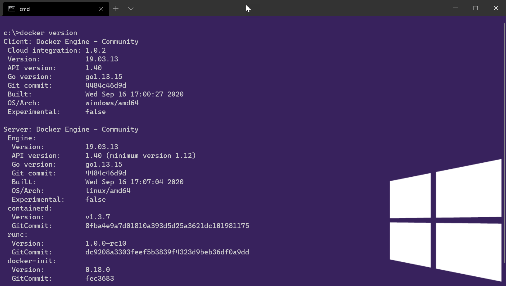

# Lab: Docker Basics

Task 1: Prepare 
1. Read [Orientan and setup](https://docs.docker.com/get-started/) from *docker docs*.  
2. Watch the [How to get started with Docker](https://youtu.be/fqMOX6JJhGo) video.

Task 2: Install Docker 
1. Download and install Docker for your corresponding platform from [Get Docker](https://docs.docker.com/get-docker/) on *docker docs*.
2. Verify the installation by running `docker version`:

    
