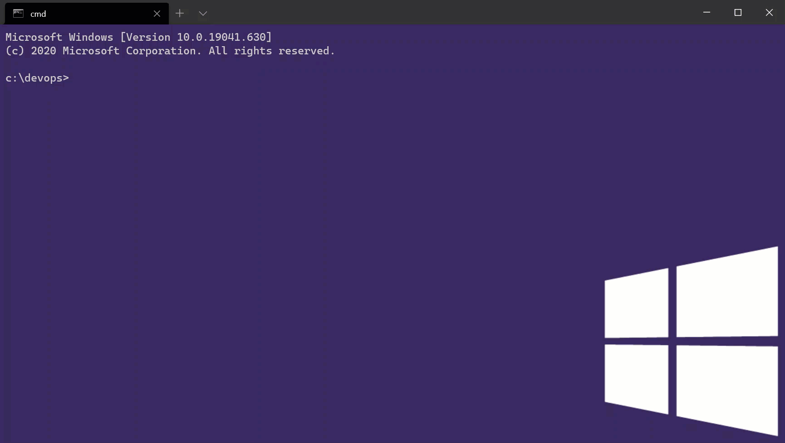

# Exercise: Docker Basics

## Task 1: Prepare 
1. Read [Orientan and setup](https://docs.docker.com/get-started/) from *docker docs*.

2. Watch the [How to get started with Docker](https://youtu.be/fqMOX6JJhGo) video.

## Task 2: Install Docker 
1. Download and install Docker for your corresponding platform from [Get Docker](https://docs.docker.com/get-docker/) on *docker docs*.

2. Verify the installation by running `docker version`.

    

## Task 3: Create and start a "Hello World" image 
1. Create a new file called *Dockerfile* 

2. Modfy the *Dockerfile* created by adding the line below. Choose a *parent image* your docker image should be based on. In our case we choose *Alpine* wit the *latest* tag to indicate the most recent version available.

    ```dockerfile
    FROM alpine:latest
    ```
    Each subsequent line in the *Dockerfile* will create a new layer on top of the base image referenced. Make sure to work through the [Docker Layer Lab](https://github.com/aheil/hhn-devops/blob/main/labs/02_container/layer.md) as well.

3. Now add the following line to the*Dockerfile*:

    ```dockerfile
    CMD echo "Hello world!" 
    ```

    `CMD` does not execute anything during build time of the image, instead it does specify the command to be executed for the image.
    If specified this way, the `CMD` is executed in the so called *shell* form. 


    Make sure to get familiar with the `CMD` instruction in [docker docs](https://docs.docker.com/engine/reference/builder/#cmd).

4. Build the Docker image by running `docker build`.

    

5. Locate the ID of the image. Look for the following line in the previous output (the ID will be different for you). 

    ```shell
    Successfully built f1fb2bd14df0
    ```

6. Have a look which images are available after building the previous  steps by executing `docker image ls`.

   


    In this example you see the parent image *alpine* as well as the recently created image *<none>* with the ID *f1fb2bd14df0*.

7. Execute the image (aka start the container) by calling `docker run f1fb2bd14df0` (or whatever ID your image is). 

   

8. By calling `echo "Hello World!"`, the command was executed in `bin/sh -c` wherer the paramter *c* is described in the manpages as following: 
 
    > `-c string If  the  -c  option  is  present, then commands are read from string.  If there are arguments after the  string,  they  are assigned to the positional parameters, starting with $0.`

    If an argument is passed to the shell without the paramter, it is interpreted as script to be executed. With the paramter, the string given is executed. In out case `echo "Hello World"` is executed by the shell.

    Now replace the `CMD` line with its so called *exec* form:

    ```docker
    CMD ["echo", "Hello World"]
    ```

    All paramters are passed using he JSON array form. 
    Now repeat every step beginning with 4 to 7. 

<!--
2. Create a new file called *entrypoint.&#8203;sh* 
-->
