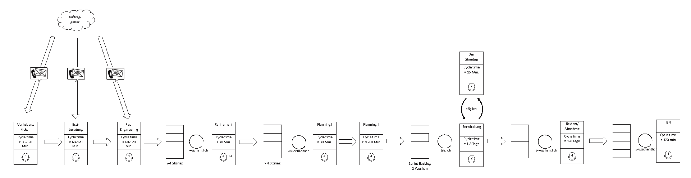

# Lab 10 - Value Stream Mao 
## Exercise - Cycle Time 

## Total Value Added Time

Refer to the value stream map given below. 

1. Calculate the total value added tim of this process. Calculate both, the best and the worst case based on the cycle times given in the map.
2. Given the lead time of the process is 90 working days in average (assume 8h per working day), how much time is wasted in the overall process. 

