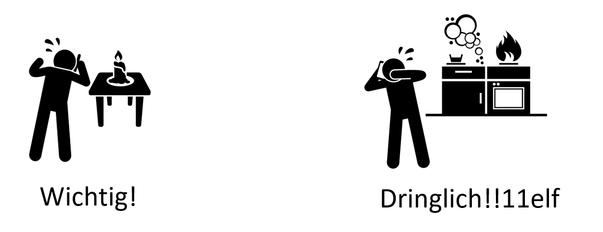
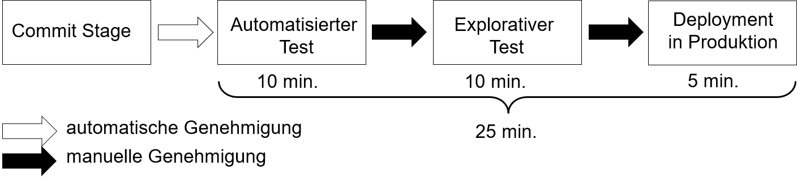
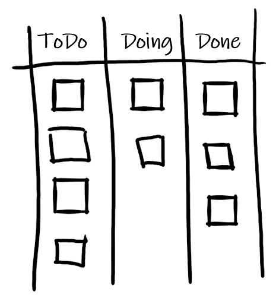
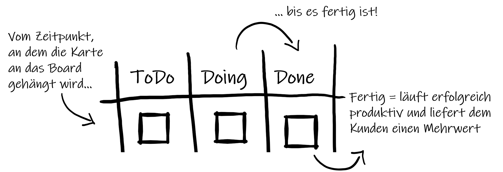
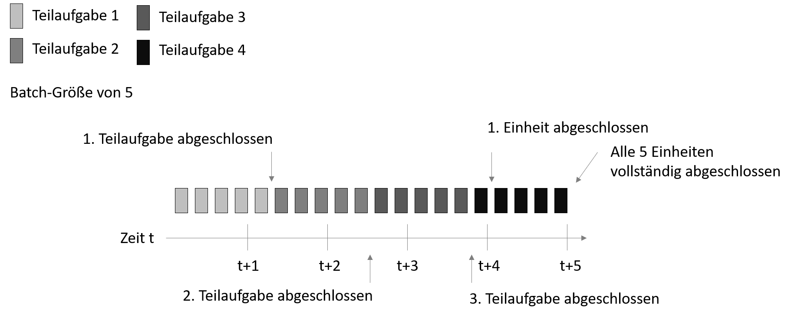
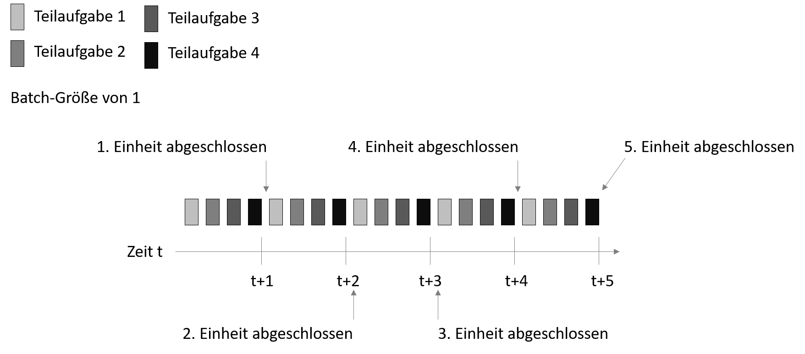

# DevOps 
## Phylosophie
Prof. Dr.-Ing. Andreas Heil

 Licensed under a Creative Commons Attribution 4.0 International license. Icons by The Noun Project.

v1.1.0

---

# Teil 1: Motivation

---

# Lernziele dieser Einheit 

* **Verstehen** worin die Probleme in der klassischen Trennung zwischen Entwicklung und Betrieb liegen.
* Den *zentralen chronischen Konflikt* als auch die damit in Zusammenhang stehende Abwärtsspirale hinsichtlich von Firmenzielen **kennenlernen und verstehen**

---

# Was (denken wir) über DevOps zu wissen?

1. DevOps funktioniert nur für StartUps
2. DevOps ersetzt Agile 
3. DevOps ist nicht kompatibel zu ITIL
4. DevOps funktioniert nicht mit Security und Compliance
5. DevOps macht den IT-Betrieb überflüssig
6. DevOps ist nur Automatisierung
7. DevOps geht nur mit Open Source Software
8. DevOps ist ein Tool

--- 

# Beschleunigter Trend 

| | 1970er bis 1980er | 1990er | 2000er bis heute |
|---|---|---|---|
|Ära|Mainframes|Client/Server|Commodities u. Cloud|
|Repräsentative Technologien|COBOL, DB2|C++, Oracle, Solaris|Java, MySQL, Red Hat, Ruby on Rails, PHP, JS|
|Zyklusdauer|1-5 Jahre|3-12 Monate|2-12 Wochen|
|Kosten|1.000.000 - 100.000.000 US$|100.000-10.000.000 US$|10.000-1.000.000 US$|
|Riskant für|Gesamtes Unternehmen|Produktlinie/-bereich|Produkt-Feature|
|Folgen bei Fehler|Bankrott, Firmenaufkauf, Entlassungen|Umsatzziele verfehlt, CIO gefeuert|vernachlässigbar|

--- 

# Der zentrale Chronische Konflikt

---

# Die Abwärtsspiral 1/3 

* Instandhalten zentraler, kritischer und meist sehr fragiler Systembestandteile –  „… wir räumen das später auf…“

* Die Systeme, die an den ehesten Problemen bereiten 
    * Sind unserer wichtigsten Systeme
    * Sind Ziel der dringlichsten Änderungen  
    * Schlagen die Änderungen fehl, hat dies massive Auswirkungen auf Kunden, Umsatz, Sicherheit, Finanzen etc.

---

# Exkurs: Dringlich vs. Wichtig 

Im Sprachgebrauch werden dringlich und wichtig oft und gerne vermischt…   
> Ist das geplante Release wichtiger als die Fehlkonfiguration der Firewall? Was ist dringlicher?

---

# Die Abwärtsspirale 2/3

* Als Konsequenz aus den zuvor genannten Problemen…
    * Es werden neue Features versprochen
    * Der Technologiebereich einer Unternehmung muss diese realisieren
    * Das Versprechen findet statt ohne zu wissen, ob dies technologisch überhaupt möglich ist

* Jetzt gibt es also noch ein neues dringenderes Projekt 
    * Neue Herausforderungen
    * Neue Technologien
    * Mehr technische Schulden – „… wir räumen das später auf…“ 

---

# Die Abwärtsspirale 3/3

* Nun sind alle beschäftigt
    * Alles muss am Laufen gehalten werden 
    * Alle haben weniger Zeit und alles dauert etwas länger 
    * Kommunikation dauert etwas länger 
    * Kleine Aktionen haben zu großen Auswirkungen 
    * Liste der Aufgaben wird länger 
    * Alles wird etwas aufwendiger
    * **Der Betrieb hat es immer schwerer stabile IT Services zu liefern**
    * Änderungen sind nicht willkommen 
    * **Die Entwicklung kann nicht mehr auf Änderungen reagieren**

---

# Nicht-technische Konsequenzen

* Überstunden
* Arbeiten am Wochenende
* Probleme bei Deployments bis hin zu Ausfällen
* Bereitschaften
* Persönliche Heldentaten einzelner Mitarbeiter (Feuerwehreinsätze)
* Burn-Out 
* Kündigung (der besten Mitarbeiter)
* …

---

# Teil 2: Historie 

---

# Lernziele für diese Einheit

Den Ursprung der DevOps Bewegung **kennen lernen** und die »Konvergenz von DevOps« **verstehen**.

---

# Ursprung

DevOps wurde nicht erfunden, sondern basiert auf
* Lean,
* der Theory of Constraints, 
* dem Toyota Production System,
* dem Resilience Engineering,
* firmenweiten Lernen, 
* einer ausgeprägten Sicherheitskultur, 
* zahlreichen menschlichen Aspekten und
* agilen Methoden.

---

# Lean Bewegung

* In den 1980er im Toyota Productive System begründet
    * Value Stream Mapping
    * Kanban-Boards
    * Total Productive Maintenace 
    * Just-in-Time-Konzept 
    * Jidoka und Kaizen (jap.) als zentrale Philosophien

* Grundsätze
    * Durchlaufzeiten als bestes Maß für Kunden- und Mitarbeiterzufriedenheit
    * Kleine Arbeitseinheiten die beste Voraussetzung für kurze Durchlaufzeiten

---

# Agile Manifesto 

* 2001 begründet 
* Schlanker Satz von Werten und Prinzipien 
    * Regelmäßige Auslieferungen von Software als Inkremente
    * Kleine bzw. kurze Zeiträume
    * Kleine motivierte Teams
    * Vertrauensbasiertes Management Modell

* Starker Zusammenhang von DevOps und der Agile Community

---

# Agile Infrastructure und Velocity

* 2008 – Patrick Deboid und Andrew Shafer unterhielten sich über die Anwendung agiler Prinzipien auf Infrastruktur 
* 2009 – John Allspaw und Paul Hammond auf O‘Reilly‘s Velocity Konferenz stellen vor, wie Entwicklung (Dev) und Betrieb (Ops) gemeinsame Ziele verfolgt hatten

---

# Continuous-Delivery-Bewegung

* Jez Humble und David Farley: Continuous Delivery aus Continuous Build, Test und Integration führten zur Deployment Pipeline 
* Code und Infrastruktur immer in einem auslieferbaren Zustand 
* Eingecheckter Code kann immer sicher in Produktivumgebung eingespielt werden 

---

# Toyota-Kata

* Mike Rother zeigte, dass die Lean Bewegung den Verbesserungsprozess bisher nicht beachtet
    * Tägliche und ständige Verbesserungen

* Grund für den Erfolg von Toyota aufgrund eines Zyklus von 
    * Definieren gewünschter Zustände
    * Setzen von wöchentlichen Zielen
    * Feedback und ständiger Verbesserung der täglichen Arbeit

---

# Zusammenfassung

* DevOps ist nicht „einfach so entstanden“ und wurde nicht „erfunden“ 
* Zahlreiche Bewegungen „konvergierten“ in eine ähnliche Richtung
* Die Entwicklung von DevOps hat sich über Jahre hingezogen

---

# Teil 3: Kennzahlen in der Wertekette

---

# Lernziele in dieser Einheit

Die drei grundlegenden Metriken bzw. Kennzahlen Durchlaufzeit, Verarbeitungszeit als auch %C/A **kennen lernen**.

Probleme langer Deployment Durchläufe **verstehen** und **erkennen können**. 

Den Unterschied zwischen Durchlaufzeiten und Verarbeitungszeit **verstehen**. 

---

# Warum Kennzahlen? 

> Measurement is the first step that leads to control and eventually to improvement. If you can’t measure something, you can’t understand it. If you can’t understand it, you can’t control it. If you can’t control it, you can’t improve it. - Dr. H. James Harrington.

---

# Lean Manufacturing

* Prinzipien und Theorien 
* Wertekette als „Folge von Aktivitäten, die eine Firma vornimmt, um eine Kundenanforderung zu erfüllen“
* Voraussetzungen für schnelle Durchlaufzeiten: reibungsloser und gleichmäßiger Arbeitsfluss

---

# Technologie-Wertekette

Prozess der ein Geschäftsziel in einen durch Technologie unterstützten Dienst wandelt.

* Begin: Arbeit in der Entwicklung / Backlog aufnehmen
* Entwicklung: Implementierung von Code, Commit in eine Versionsverwaltung, von wo aus, jede Änderung gebaut und mit dem Rest der Anwendung integriert und getestet wird
* Wertschöpfung: Entsteht erst, wenn die Dienste produktiv laufen

⏩ Entwicklung muss in einem schnellen Flow liefern
⏩ Deployment darf weder Chaos, Ausfälle noch Probleme verursachen

---
# Durchlaufzeiten

* Da für den Kunden relevant, sind Durchlaufzeiten meist im Fokus von Prozessoptimierungen
* Verhältnis von Verarbeitungszeit zu Durchlaufzeit ist wichtige Kennzahl für Effizienz
* Kurze Verarbeitungszeiten bedeuten kürzere Wartezeiten 

---

# Klassische Durchlaufzeiten

* Wochen bis Monate
* Lange Laufzeiten erfordern Heldentaten
* Probleme werden erst spät erkannt
* Oftmals mit manuellem Testen und Bestätigungsprozessen verbunden

---

# Kurze Deployment-Durchlaufzeiten

* Entwickler erhalten schnell und fortwährend Feedback zur Arbeit 
    * Konsequenz: Schnell und unabhängig 
        * Implementieren
        * Integrieren
        * Validieren 
        * Deployen
* Notwendig
    * Modulare Architektur 
    * Saubere Kapselung 
    * Loose gekoppelte Komponenten

⏩ Fehler bleiben überschaubar, können schnell eingegrenzt werden und verursachen keinen globalen Schaden!

---

# Deployment-Durchlaufzeiten

* Deplyoment-Durchlaufzeiten beginnen mit dem Check-In,
* enden mit dem Deplyoment und 
* sind Teil der Verarbeitungszeit

---

# Qualitätsmetrik: Complete and Accurate 

* Complete and Accurate (%C/A) 
>% the customer can perform a task without having to **CAC** 
    &nbsp;&nbsp;&nbsp;&nbsp;&nbsp;- **C**orrect information that was supplied 
    &nbsp;&nbsp;&nbsp;&nbsp;&nbsp;- **A**dd missing information that should have been supplied 
    &nbsp;&nbsp;&nbsp;&nbsp;&nbsp;- **C**larify information provided that should have been clear

* D.h. wieviel % der Arbeit kann entlang der Wertekette genutzt werden ohne die erhalten Daten korrigieren, ergänzen oder nachfragen zu müssen
* Bei uns: Wieviel der Arbeit kann im nächsten Prozessschritt genutzt werden, ohne diese zu überarbeiten.

---

# %C/A am Beispiel 

* Um möglichst schnelle Deployment-Durchläufe zu erreichen ist eine hohe %C/A erforderlich
    * Wieviel kann ohne CAC getestet werden
    * Wieviel kann ohne CAC explorativ getestet werden
    * Wie gut kann ohne CAC deployed werden

---

# Zusammenfassung

* Drei Kennzahlen
  * Durchlaufzeit
  * Verarbeitungszeit
  * Complete and Accurate (%C/A)

* Für bessere Durchlaufzeiten muss auch die Verarbeitungszeit optimiert werden

* Kurze Durchlaufzeiten fördern schnelles und unabhängiges Arbeiten 

---

# Teil 4: Flow 

---

# Lernziele in dieser Einheit 

* Die drei Wege in DevOps **kennen lernen**

* Den Nutzen von WIP-Limits **verstehen**

* Single Piece Flow **kennen lernen** und die daraus resultierende Konsequenz **verstehen**

---

# Drei Wege 

Drei Wege als grundlegende Prinzipien für Verhaltensweisen und Muster in DevOps

* Flow 
* Schnelles und kontinuierliches Feedback
* Kultur des firmenweiten kontinuierlichen Lernens

---

# Arbeit sichtbar machen

In Technologiewerteketten ist nicht ersichtlich
* Wo die Arbeit stockt
* Wo sich Arbeit stapelt 
* Wo Arbeit hin- und her geschoben wird
* Wo Arbeit begonnen aber nicht beendet wird

Lösung: Arbeit via sog. Arbeitsboards sichtbar machen 
* Sprint-Planungs-Boards
* Kanban Boards 

---

# Durchlaufzeit

* Wie bestimmt sich die Durchlaufzeit?
* Wann ist die Arbeit fertig?

---

# Work in Progress

* Im Industriellen sind die Arbeiten durch Fertigungsprozesse und Kundenbestellungen geprägt …
* … in der IT oftmals durch dringlichere Aufgaben, der „Priorität des Tages“.

Konsequenz
* Unterbrechungen
* Multitasking
* Damit verbundene Mehraufwände 

---

# Work in Progress (WIP) limitieren:

* Es darf an nichts gearbeitet werden, was nicht zuvor auf einer Karte festgehalten wurde 
* Es darf nur an etwas gearbeitet werden, das sich in der Spalte „in Progress“ oder „in Arbeit“ hängt 
* Es darf nur eine bestimmte Anzahl Karten in der Sparte „in Progress“ bzw. „in Arbeit hängen“ 

---

# WIP-Limit Konsequenzen 

WIP-Limits sind wichtige Indikatoren für Durchlaufzeiten [W1, W2].
* Nichts zu tun trotz voller Spalte „in Bearbeiten“!? 
* Was bedeutet das?
* Verlockend, jetzt etwas anderes anzufangen! 
* Besser: Herausfinden, warum wir warten und die Ursache beseitigen! 

## ⏩ Stop starting, start finishing!
 
---

# Single-Piece Flow

* Kleine Batch-Größen
* Lean: Batch-Größen kontinuierlich zu verringern 
* Theoretische Untergrenze: Single-Piece Flow

---

# Große Batch-Größen

---

# Kleine Batch-Größen

---

# Zusammenfassung 

* 3 Wege
* Flow erzeugen durch 
    * Sichtbar machen der Arbeit 
    * WIP-Limits einführen
    * Kleine Batch-Größen nutzen
* Ausstehend
    * Übergaben minimieren
    * Flaschenhälse identifizieren und beseitigen 
    * Verschwendung minimieren 

---

# Quellenverzeichnis (Teil 1)

* Adrian  Cockcroft, Velocity  and  Volume (or  Speed  Wins), Flowcon, November  2013, 2013 
* KEYNOTE: Velocity and Volume (or Speed Wins) by Adrian Cockcroft, https://www.youtube.com/watch?v=wyWI3gLpB8o
* Eliyahu M. Goldratt, Beyond the Goal: Theory of Constraints (Hörbuch), 2005

---

# Quellenverzeichnis (Teil 2)
* Toyota Motor Corporation , Toyota Production System, https://global.toyota/en/company/vision-and-philosophy/production-system/
* K. Beck, et al, Agile Manifest, https://agilemanifesto.org/
* J. Allspaw, 10+ Deploys Per Day: Dev and Ops Cooperation at Flickr, https://www.slideshare.net/jallspaw/10-deploys-per-day-dev-and-ops-cooperation-at-flickr/ 
* P. Debois, Agile Infrastructure and Operations: How Infra-gile are You?, Agile 2008 Conference, Toronto, ON, 2008, pp. 202-207, doi: 10.1109/Agile.2008.42.
* J. Humble, C. Read and D. North, "The deployment production line," AGILE 2006 (AGILE'06), Minneapolis, MN, 2006, pp. 6 pp.-118, doi: 10.1109/AGILE.2006.53
* 10 Deploys Per Day Dev and Ops Cooperation at Flickr, https://youtu.be/c6tWX48tmAo

---

# Quellenverzeichnus (Teil 3)

* K. Martin, M. Osterling, Value Stream Mapping: How to Visualize Work and Align Leadership for Organizational Transformation, McGraw Hill, 2013
* M. Osterling, K. Martin, Lean Mindset & Behaviours, AMEChicago2012, 2012, https://www.slideshare.net/KarenMartinGroup/lean-mindsets-behaviors-workshop-ame-chicago-2012 

---

# Quellenverzeichnis (Teil 4)

* G. Kim, K. Behr, G. Spafford , Projekt Phoenix: Der Roman über IT und DevOps , O`Reilly, 2015
* J.S. Rubinstein, D.E. Meyer, J.E. Evans, Executive control of cognitive processes in task switching. Journal of Experimental Psychology: Human Perception and Performance, 27(4), 763–797, 2001, https://doi.org/10.1037/0096-1523.27.4.763
* D. DeGrandis, DOES15 - Dominica DeGrandis - The Shape of Uncertainty, https://www.slideshare.net/ITRevolution/does15-dominica-degrandis-the-shape-of-uncertainty 
* D. DeGrandis, DOES15 - Dominica DeGrandis - The Shape of Uncertainty, https://www.youtube.com/watch?v=Gp05i0d34gg

