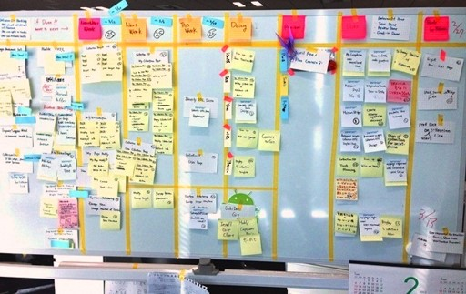

# DevOps 
## Kanban
Prof. Dr.-Ing. Andreas Heil

 Licensed under a Creative Commons Attribution 4.0 International license. Icons by The Noun Project.

v1.0.0

---

# Lernziele

* Grundlegende Konzepte hinter Kanban **kennen lernen**
* Unterschiede (Vor- und Nachteile) gegenüber anderen agilen Ansätzen **verstehen**
* **Verstehen** wann Kanban vorzugsweise eingesetzt werden kann 

---

# Inhalt 

* Kanban Einführung 
* Kanban Board 
* Work in Progress 
* Praxis Tipps
* Praxisübung

---

# Kanban Ursprung

* Jap. kan 看 (sichtbar) und ban  板 (Karte o.d Brett)
* Konzepte entstammen dem Toyota Production System (TSP)
* Konkret: Just-in-Time Scheduling System
    * Nur »machen« was benötigt wird 
    * Nur »machen« wenn es benötigt wird 
    * Nur »machen« wieviel benötigt wird

Kanban System wurde sowohl für die Produktion als die Software Entwicklung adaptiert. 

---

# Toyota Kanban

> The kanban, a tool that describes **which and how many parts are used where and when, made just-in-time production possible**. The new kanban management system was adopted at all plants in 1963. By producing parts in accordance with the instructions on the kanban, **parts are delivered among the different plants only in the volumes needed, and inventories within each process can be eliminated**. As kanban came into widespread use, problems such as standardization of work and transport management were resolved one after another and production lines operated smoothly.[^1]

---

# Drei Prinzipien

* Visualize
* Limit Work in Progress
* Manage Flow

---

# Das Kanban Board

---

# Visualisieren

* Information Fridge
    * Muss immer wieder geöffnet werden, um nachzuschauen ob „etwas Neues drin ist“
    * Klassische Ticket-Systeme, digitale Boards etc.

* Information Radiator
    * Große sichtbare Displays
    * Für das eigene Team und alle Interessierten
    * Aktualisierungen möglichst einfach halten
    * So groß wie möglich!!! 
    * »Use it or lose it!« 

---

# Kanban Board Beispiel

[1]

---

# Kanban Board - Tips

* Große Boards verwenden (s. Information Radiator)
* Digitale und physische Boards haben beide Vor- und Nachteile 
* Bei ungeübten Teams möglichst physische Boards nutzen
* Regelmäßige Stand-Ups (Daily Stand-Up)
* Den Workflow anpassen, das Board reflektiert den aktuellen Workflow im Team
* Der Workflow kommt nicht vom Management, sondern vom Team 
* Nicht zu viele Gedanken machen, Änderungen willkommen heißen 

---

# Kanban Board - Beispielaufbau

--- 

# Enter & Exit Critera

--- 

# Priorisierung

* Anders als in Scrum: 
    * Priorisierung kann fortwährend erfolgen 
Täglich, u.U. auch wöchentlich oder zwei-wöchentlich

* Reihenfolge der Tickets am Board spiegelt die Priorität wieder 
    * Es wird immer das am höchsten priorisierte Ticket gezogen
    * No-Go: Ticket ziehen, das einem am meisten Spaß macht 

---

# Work in Progress

---

# Work in Progress

* Beinhaltet alle begonnen aber noch nicht abgeschlossenen Aufgaben
    * Auch alle Aufgaben, an denen gerade nicht gearbeitet wird
    * Auch alle Aufgaben, für die gerade auf Zuarbeit geartet wird 
* Abk.: WiP 
* WiP-Limit
    * Anzahl an gerade in Bearbeitung befindlicher Aufgaben limitieren
    * Anzahl der Tickets 
    * Typischerweise pro Spalte (in Bearbeitung, Test, Abnahme etc.) 

---

# Little's Law

* Ursprung: John D.C. Little 
    * In den 1950 einfach angenommen
    * Erst Ende der 1960er bewiesen 
* Bedeutung: Je mehr gleichzeitig bearbeitet wird, desto länger dauert die Fertigstellung aller »Work Items«

---

# Auswirkung von Parllelität

---

# WiP Limit

---

#ä WiP Limit Wisdoms

* Es gibt keine »goldene Regel«
* Beobachten und anpassen
* Guter Ansatz: »Stop starting, start finishing « 
* Beispiel 1: Um Pairing zu forcieren kann ein WiP-Limit von $Teamgröße -1$ gewählt werden 
* Beispiel 2: Existieren z.B. externe Abhängigkeiten (=Wartezeiten) kann ein WiP Limit von $Teamgröße \cdot 2$ gewählt werden um Wartezeiten (engl. idle time) zu vermeiden
* Beispiel 3: … 

---

# Praxis Tipps

---

# Praxis Tipps 

* Durchsatz erhöhen
* Verschwendung (jap. muda 無駄) z.B. durch Wartezeiten oder Blocker vermeiden 
* Probleme schnell lösen 
* Kanban ermöglicht häufig Priorisierung (signifikanter Unterschied zu Scrum) 
* Geeignet für kleine und bekannte Arbeitseinheiten (z.B. im Ops Umfeld) 
* Schlechter für Entwicklung, da Aufgaben geschätzt werden müssen 
WiP-Limits einhalten

---

# Referenzen

[^1]: https://www.toyota-global.com/company/history_of_toyota/75years/text/entering_the_automotive_business/chapter1/section4/item4.html

---

# Bildquellen

[1] Rakuten Inc.,  https://commons.wikimedia.org/wiki/File:Lean_Kanban.jpg, CC BY-SA 3.0 (https://creativecommons.org/licenses/by-sa/3.0)
