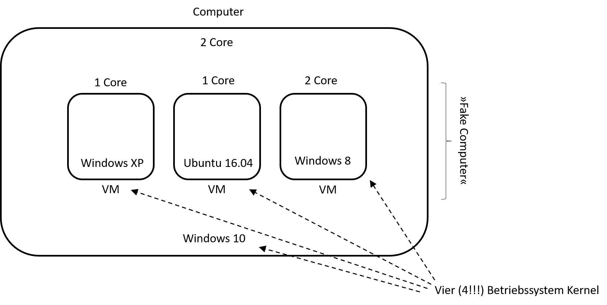
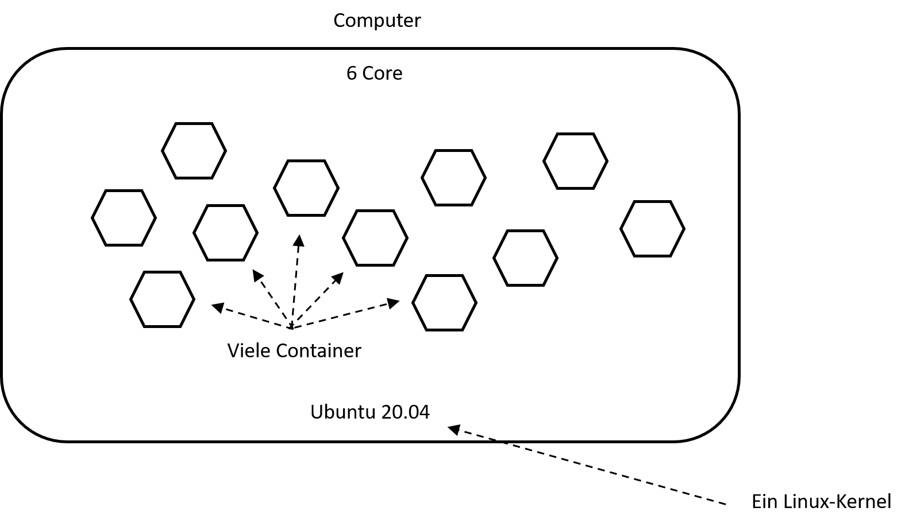
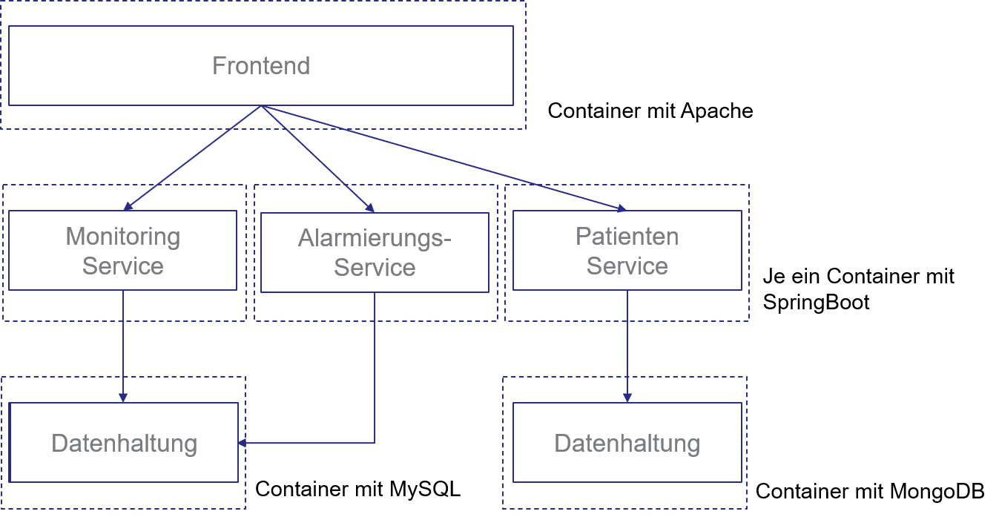
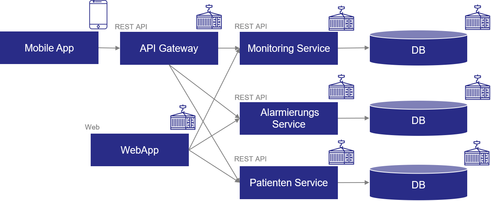
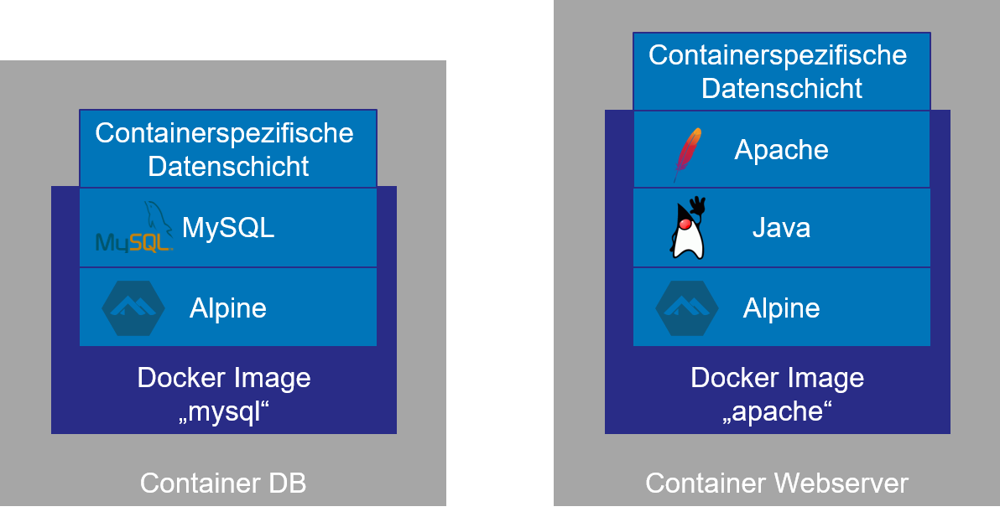
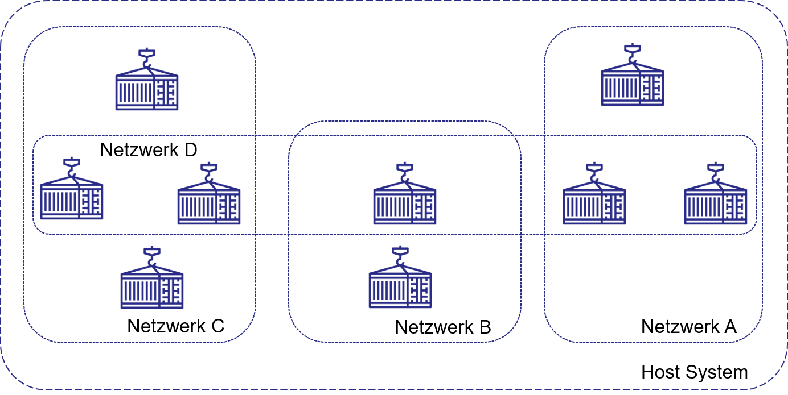
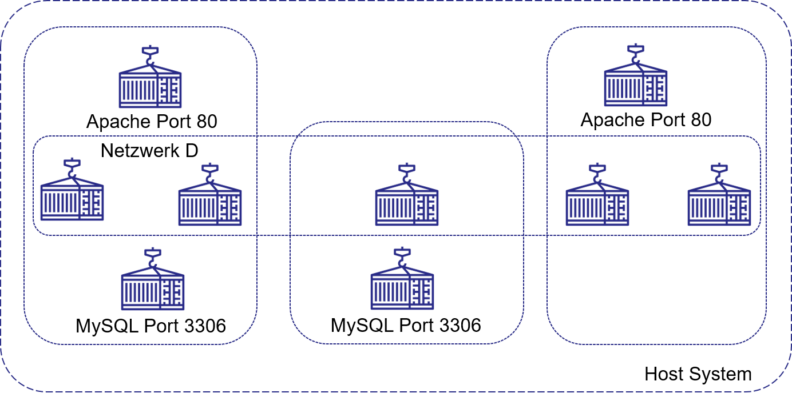
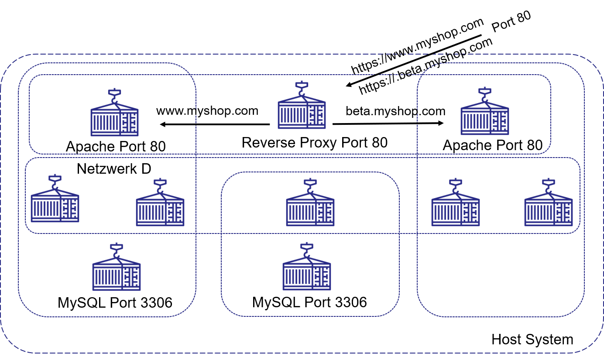
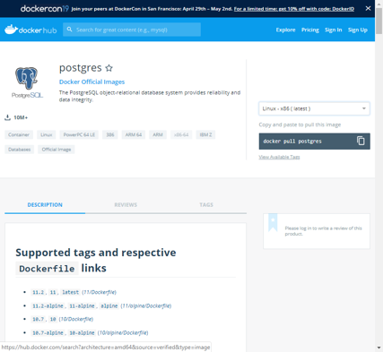

<style>
img[alt~="center"] {
  display: block;
  margin: 0 auto;
}
</style>
# DevOps 
## Einführung in Container und Docker
Prof. Dr.-Ing. Andreas Heil

 Licensed under a Creative Commons Attribution 4.0 International license. Icons by The Noun Project.

v1.1.0

---

# Idee hinter Containern (1)

* Intuitives Vorgehen
    * Alle Dienste, Server-Komponenten und Datenbanken auf einem Server/Rechner installieren 
    * Vorteil: Einfach Installation, einfache Kommunikation unter den Diensten
    * Nachteil: Über die Zeit immer schwerer wartbar 

---

# Idee hinter Containern (2)

* Fortgeschrittenes Modell 
    *  Dienste, Server-Komponenten und Datenbanken auf unterschiedlichen Servern (auch virtuellen Maschinen), z.B. 
        * VM für Web Server
        * VM für Datenbank 
        * VM für Monitoring 
    * Vorteil: Unabhängig
    * Nachteile
        * Wartung vieler (virtueller) Maschinen, i.d.R. durch Betriebsteam
        * Ressourcenverbrauch 

---

# Virtuelle Maschinen (VMs) auf einem Rechner



---

# Container auf einem Rechner



---

# Idee hinter Containern (3) 

* Container Modell
    * Dienste, Server-Komponenten und Datenbanken werden in kleinen, isolierten Containern betrieben, z.B.
        * Container für Front-End 
        * Je ein Container pro Service
        * Je ein Container pro Datenbank 
    * Vorteile
        * Leichtgewichtig
        * Unabhängig 
        * Konfigurierbar 
    * Nachteile
        * Stichwort Kubernetes 


---

# Beispiel einer Software in Containern



--- 

# Automatisierung mit Containern

* Mit Container-Technologie lässt sich sehr viel (alles) automatisieren
* Stichwort: GitLab CI/CD (später mehr dazu) 
* Stichwort: Infrastructure as Code (IaS)
* Werkzeuge: Ansible, Salt, Puppet, Vagrant, GitLab CI/CD, GitHub Actions... 

---

# Container können...

* Unabhängig voneinander gewartet und aktualisiert werden 
* Können in unterschiedlichen Versionen betrieben werden
* Beeinflussen sich nicht gegenseitig

---

# Container 101

* Container enthalten eine Software und alle Abhängigkeiten
* Gestartet wird ein Container aus einem Abbild (engl. image)
* Container verhalten sich auf allen Maschinen gleich (Entwickler-Maschine, Server, Cloud-Anbieter,...)
* Für die Software sieht der Container aus wie eine eigene Maschine
* Die Software weiß nicht, dass sie in einem Container steckt
* Wird ein Container gelöscht, werden keine Konfigurationsreste auf dem Host / dem Betriebssystem hinterlassen

Daumenregel: Ein Dienst pro Container 

---

#  Beispiel Microservices



Alles auf einer Maschine oder jeder Dienst in einem eigenen Container?

---

# Beispiel Container-Umgebung



---

#  Container und Netzwerke



Container können über eigene Netzwerke miteinander kommunizieren

---

#  Nutzung von Standard-Ports in Containern



---

#  Reverse Proxy 



Löst dabei  so manche Probleme einzelner Maschinen...

---

# Docker Compose 

* Docker installieren (Linux, Windows, macOS)
    * Variante 1: Fertiges Image laden und Container starten

```bash
version: '3'
services:  my_db:
    image: postgres:9-alpine
    environment:
      POSTGRES_DB: mydb
      POSTGRES_PASSWORD: topsecret
      POSTGRES_USER: user1
volumes:
  - db-data:/var/lib/postgresql/data
restart: always
networks:
  - my_network
```

---

# Docker Compose 

* Eine Konfigurationsdatei: `docker-compose.yml`
* Container werden mit `docker-compose up` gestartet 
* Container werden mit `docker-compose down` gestopppt

--- 

# Vorsicht bei fertigen Images 



* Am Beispiel des *postgres*-Images
* Was steckt in dem Image?
* Wirklich nur die Datenbank? 
* Vielleicht ein BitCoin Miner?
* Vielleicht ein SpamBot?
* Vielleicht ein Skript das alles DB-Einträge an jemanden übermittelt?
…
⚠ Geschichten aus dem wahren Leben...

--- 

Wie bekommt man Software in einen Container?

* Docker installieren (Linux, Windows, macOS)
    * Variante 2: Eigenes Image »bauen«, Container starten 

```bash 
FROM alpine
RUN apk --no-cache add inotify-tools jq openssl util-linux bash
COPY dumpcerts.sh /dumpcerts.sh
RUN chmod +x /dumpcerts.sh
COPY entrypoint.sh /entrypoint.sh
ENTRYPOINT [ "/entrypoint.sh" ]
```
* In einem File, z.B. `Dockerfile`

👨‍🏫 Praxisbeispiele

---

Referenzen 

[1] c't wissen Docker DOCKER – Komplexe Software einfach einrichten, Heise Medien GmbH, 2019

[2] Offizielle Docker Dokumentation: https://docs.docker.com/ 
