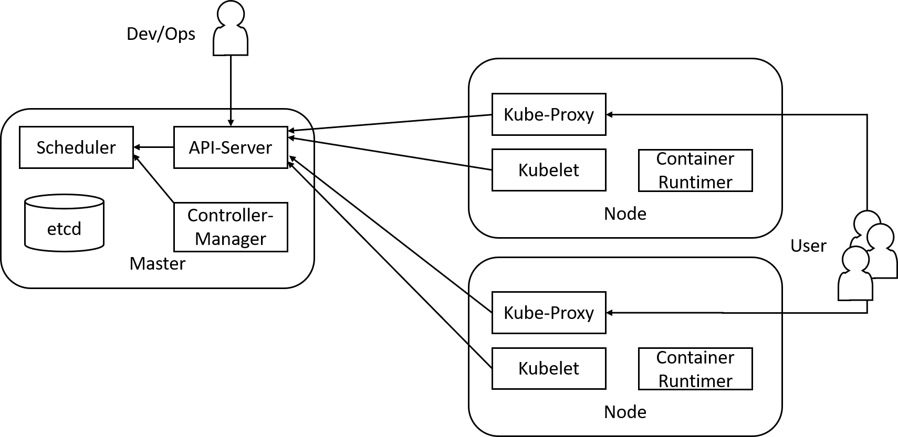

# DevOps 
## Kubernetes 
Prof. Dr.-Ing. Andreas Heil

 Licensed under a Creative Commons Attribution 4.0 International license. Icons by The Noun Project.

<!--version-->
v1.0.1
<!--/version-->

---

# Kurze Wiederholung 

* Bereits kennen gelernt: Docker und Docker Compose 
* Mittles Compose lassen sich mehrere Services (Container) verwalten und gemeinsam starten 
* Was wäre wenn Sie nun in einem *sehr großen* IT-Unternehmen arbeiten würden... Microsoft, Amazon, Google? 
* 1.000 oder 10.000 von Containern mittels 1.000d Docker-Compose-Dateien... 
* 🤯

---

# Ursprünge von Kubernetes 

* Google hatte das zuvor angesprochene Problem 
* Ca. 10 Jahre lang wurden Systeme (Borg und Omega) entwickelt und intern verwendet um die Server zu verwalten 
* 2014 wurde Kubernetes von Google als Open Source veröffentlicht
* Übergabe von Kubernetes 2015 an die neu gegründete *Cloud Native Computing Foundation* und die *Linux Foundation*.

---

# Nice to Know 

* Kubernetes stammt aus dem Griechischen ( κυβερνήτης) und bedeutet soviel wie Steuermann
* Kubernetes wird oft als K8s abgekürzt
* Minikube erlaubt es einen »lokalen Single-Node Kubernetes Cluster« zu installieren
    * U.a. für Windows verfügbar
* MikroK8s ermöglicht es einen lokalen Kubernetes Cluster zu installieren
    * Nur unter Linux verfügbar
* Vergleich zwischen Minikube und MicroK8s[^1]

---

# Was ist nun Kubernetes 

* Vereinfacht ausgedrückt: Ein Betriebssystem für Container
    * Einfache Bereitstellung von Diensten und  Anwendungen in Containers  
    * Bestmöglich Nutzung (engl. utilization) von Hardware
    * Verwaltung von vielen (tausenden) Nodes

---
# Wording 

* **Node**: Physische oder virtuelle Maschinen in einem Cluster, auf dem Node ist die Laufzeit-Umgebung für Container installiert (Docker oder Rocket/rkt )
* **Container**: Menge von isolierten Prozessen, die sich ein Kernel teilen[^2] 
* **Pod**: Enthält einen oder mehrere Container 

Ein Pod ist die kleineste Einheit zur Verwaltung von Containern

---

# Kubernetes Übersicht

--- 

# Grundlegende Funktionsweise des Masters (1)

* API-Server
    * Stellt eine REST-Schnittstelle zur Verfügung 
    * Sender Informationen an sämtliche Dienste im Cluster
* Scheduler
    * Entscheidet, auf welchem Node Pods gestartet werden
    * Monitoring der Nodes

---

# Grundlegende Funktionsweise des Masters (2)

* Controller-Manager
    * Besteht aus mehreren Controllern
    * Verantwortlich wenn Nodes "down" gehen, für die richtige Anzahl an PODs, Verwaltung von Standard-Accounts und Tokens etc.
* etcd
    * Leichtgewichtige Key-Value Datenbank zur Speicherung aller Konfigurationen des Kubernetes Clusters

---

# Grundlegende Funktionsweise der Nodes (1)

* Kube-Proxy 
    * Loadbalancer und Port Forwarding zu den Containern 
* Kublets
    * Verantwortlich für den Status des Nodes 
    * Wird vom Controller Manager gesteuert; stoppt und startet Container
    * Wird vom Controller Manager gesteuert; stoppt und startet Container
    * Rückmeldung über Status an den Master
    * Ist ein Kublet nicht mehr erreichbar, werden Pods auf anderem Node gestartet 
* Container-Runtime
    * Ist auf dem Node installiert, Docker oder rkt (Rocket)

---

# Referenzen 

[^1]: https://codefresh.io/kubernetes-tutorial/local-kubernetes-linux-minikube-vs-microk8s/
[^2]: https://github.com/aheil/hhn-devops/blob/main/slides/devops.05.de.pdf
