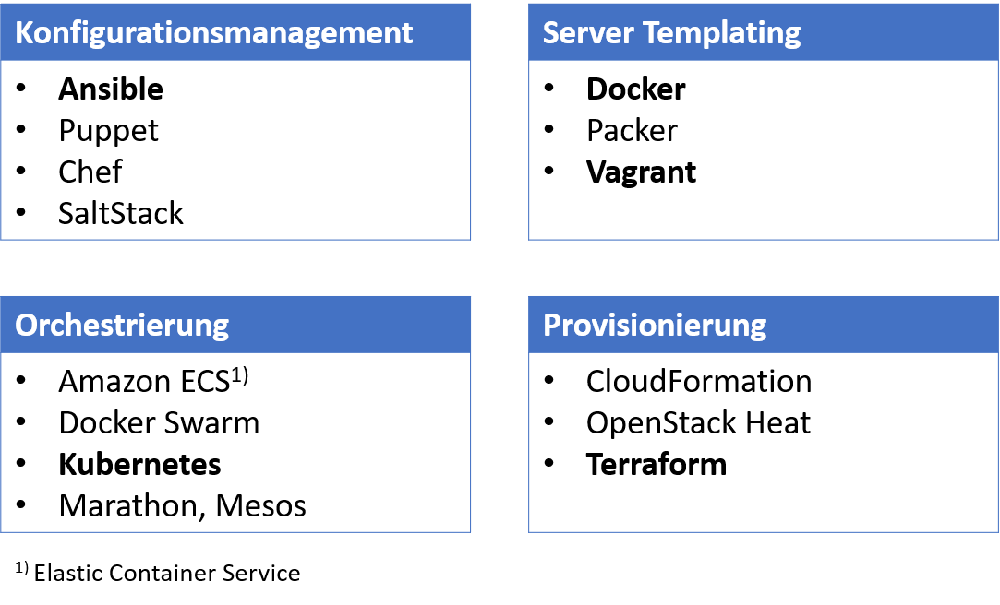

<style>
img[alt~="center"] {
  display: block;
  margin: 0 auto;
}
</style>
# DevOps 
## Terraform 
Prof. Dr.-Ing. Andreas Heil

 Licensed under a Creative Commons Attribution 4.0 International license. Icons by The Noun Project.

<!--version-->
v1.0.1
<!--/version-->

---

# Kurze Wiederholung 

* Konfiguration-Management: Installation und Verwaltung von Software auf bestehenden Servern
* Server-Templating: Erstellung von Container- oder Server-Images
* Orchestrierung: Koordinierung des Betriebs einzelner Dienste

Neu
* **Provisionierung:** Erzeugung von Infrastrukturkomponenten 
(Server, Netzwerke, Datenbanken, Caches etc.) 

---

# IaC Tools



---

# Was ist Terraform

* Terraform ermöglicht das Verwalten und Automatisieren der eigenen 
    * Infrastruktur, 
    * Plattform und
    * Services, die auf dieser Infrastruktur laufen

Auf Basis einer deklarativen Sprache... 🤔 

 ---

# Deklarativ vs. Prozedural 

* Imperativ: Wie wird ein Ziel erreicht, jeder Schritt wird beschreiben
    * Java
    * C#
    * ...

* Deklarative: Was soll das Endergebnis sein, nur das Ergebnis wird beschrieben
    * Maven
    * Ansible
    * ...

---

 # Was bedeutet Infrastruktur-Provisionierung?

 * Angenommen wir möchten eine Anwendung deployen  
    * Wir benötigen z.B. mehrere Server um unserer Microservices zu deployen als Docker Container
    * Einen Datenbank Container 
    * Und zwar alles auf der Amazon Cloud...

---

# Notwendigen Schritte bei AWS 

* Netzwerk einrichten 
* EC2 Server Instanzen einrichten
* Docker und allerhand anderer Tools auf den Servern installieren 
* Security (Firewalls etc.)... fast vergessen


---

# Wir haben jetzt erst die Infrastruktur fertig 

* Anwendungen werden deployed 

---

# Zwei Arbeitsschritte 

* In einem DevOps Team wird das idR durch zwei Team-Mitglieder durchgeführt
* Klassisch werden beide Tätigkeiten sogar von zwei Teams durchgeführt, die Infrastruktur liegt z.B. in der Hoheit der zentralen IT-Abteilung, während die Anwendung durch das Entwicklungsteam deployed wird (oder noch schlimmer) die Anwendung zum Deployen bereitstellt

---

# Terraform vs. Ansible

* Ist für den ersten Arbeitsschritt gedacht 

* Aber was ist jetzt der Unterscheid zu Ansible?
    * Beides "ist" Infrastructure as Code 
    * Beide werden zum Provisionieren, Konfigurieren und Verwalten der Infrastruktur genutzt 
* Terraform ist jedoch überwiegend zum Provisionieren der Infrastruktur gedacht 
* Ansible ist überwiegend ein Konfigurations-Management-Tool, zum Installierend und Updaten von Software
* Terraform hat Vorteile in der Orchestrierung

---

# Zusammenfassender Vergleich

* Terraform ist geeignet um die Infrastruktur aufzusetzen 
* Ansible ist besser dafür geeignet um die Infrastruktur zu konfigurieren 
* Um alles 

---

# Was ist Management von Infrastruktur

* Server hinzufügen (um weitere Services zu deployen)
* Neue Sicherheitsnahmen ausrollen
* Vorher getätigte Konfigurationen rückgängig machen

---

# Replikation von Infrastruktur

* Mehrere Umgebungen identisch aufsetzen 
    * Entwicklung (Dev)
    * Test 
    * Performance-Test (Perf)
    * Staging 
    + Produktion (Prod) 

---

# Funktionsweise (1)

* Terraform besteht aus zwei grundsätzlichen Komponenten 

* Terraform Core
    * Nutzt TF-Konfigurationen (was wird benötigt)
    * Terraform State
    * Hält den aktuellen Status des Setups vor
    * Core nutzt beide Informationen um zu entscheiden was erstellt, gelöscht oder aktualisiert werden muss 
    * Core ermittelt demnach welche Schritte notwendig sind um den Zielzustand zu erreichen

---

# Funktionsweise (2)

* Providers
    * Iaas: AWS, Azure, GCP 
    * PaaS: Kubernetes
    * Saas: Fastly  

> 100 Providers + > 1.000 Resources 

* Ressourcen Am Beispiel Kubernetes: Services, Deployments etc. 

---

# Ablauf 

* Core erstellt einen Ablaufplan (engl. execution plan)
* Core nutzt Provider um einzelne Schritte (z.B: AWS, GitHub, K8s, MySQL etc.) auszuführen

---

# Beispiel 

Kubernetes Provider[^1]:

```terraform
provider "kubernetes" {
    config_context "devops"
} 

resource "kubernetes_name" "hhn" {
    metadata {
        name = "common"
    }
}
```

Es werden immer Ressourcen und deren Attribute definiert.

---

# Deklarativ 

* Terraform wird der Zielzustand definiert 
* Es macht am Anfang eines Setup kaum ein Unterschied ob deklarativ oder imperativ 
* Je größer und "älter" die Umgebung ist, desto einfach macht es uns jedoch das Leben (vgl. Ansible Demo) 
* Beispiel: Neuer Zustand: 9 Server, und folgende Firewall-Einstellungen
* Konfigurationsdatei entspricht immer der aktuellen Zustand 

---

# Terraform Kommandos

* refresh - holt sich den aktuellen Zustand des Systems 
* plan - Execution plan erstellen 
* apply - Der Execution PLan wird ausgeführt
* destroy - alles wird rückgängig gemacht

---

# Referenzen 

https://registry.terraform.io/providers/hashicorp/kubernetes/latest/docs

[^1]:https://registry.terraform.io/providers/hashicorp/kubernetes/latest/docs 
