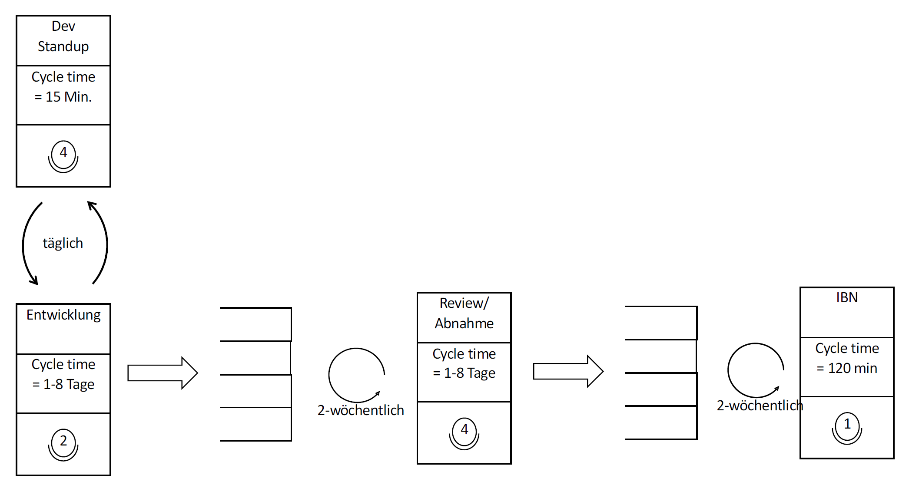

# DevOps 
## Valie Stream Maps 
Prof. Dr.-Ing. Andreas Heil

 Licensed under a Creative Commons Attribution 4.0 International license. Icons by The Noun Project.

<!--version-->
v1.0.1
<!--/version-->

---

# Lernziele

Eine Methode kennen lernen, um in komplexen Produktionsabläufen lange Laufzeiten zu erkennenr und zu reduzieren.  

...

---

# Motivation 

Angenommen Sie arbeiten in einem agilen Team, Entwicklung und Betrieb gemeinsam in einem DevOps Team. Ihr Team ist für die Weiterentwicklung und den Betrieb eines zentralen Bestandteiles der Unternehmensinfrastruktur verantwortlich. Ihr Team arbeitet seit Monaten »am Limit«. 

Eines Morgens kommen Sie ins Büro und werden kurzfristig zu einem Eskalationstermin gerufen. Die internen Kunden beschweren sich, dass Ihre Entwicklung so »teuer sind«. Eine Anforderung kosten über 20- bis 30-Tausend Euro und Sie sollen Ihren Prozess optimieren.  

**Die Zukunft Ihres gesamten Teams steht auf dem Spiel.**

---

# Eine erste Analyse

* Tatsächlich, in der Regel dauert es 3-4 Monate, bis eine Anforderung vom internen Kunden in Betrieb geht 
* Ein Blick in die Zeiterfassung zeigt jedoch, dass die Aufwände für Entwicklung neuer Anforderungen im Median weniger als 1 Personentag in Anspruch nimmt. zeigt jedoch, dass für jede Anforderung nur wenige 

---

# Eine Idee 

* Es scheint einen Unterschied zu geben, wie lange die **Laufzeit** ist, um eine Anforderung umzusetzen und der tatsächlichen **Bearbeitungszeit**. 
* Allerdings scheinen die Kosten nicht der Bearbeitungszeit zu entsprechend. 
* Der Gesamtprozess sollte daher genauer betrachtet werden.

---

# Value Stream Maps (VSM)

* Aus der industriellen Fertigung 
* Beschreiben den Materialfluss vom Lieferanten bis zum Kunden durch die eigene Organisation
* Lassen Wartezeiten, zu geringe oder zu große Materialbestände erkennen

---

# Praxistipps 

* VSMs am besten zunächst auf Papier zeichnen 
* Ein möglichst großes Papier verwenden
* Möglichst viele Beteiligte entlang der Wertschöpfungskette involvieren 
* VSMs sind keine Einzeltätigkeiten oder Aufgaben, die an einen Consultant »outgesourced« werden sollten

---

# Erforderlichen Schritte

* Wertstromanalyse 
    * Wahl des Produktes/Produktfamilie  
    * Erstellung der Ist-Map
* Werstromdesign
    * Erstellung der Soll-Map
    * Erstellung des Umsetzungsplans

Fokus heute: Ist-Map

---

# Prozessübergreifende Zusammenhänge

* Transparente Darstellung von Informationsfluß (und Materialfluß) und Darstellung von Zusammenhängen
* Betrachtung des Gesamtprozesses anstelle von Einzelpersonen
* Verbesserungspotentiale werden leicht erkennbar
* Auswirkungen geplanter Maßnahmen in Bezug auf den Prozess werden besser abschätzbar

---

# Auswahl des Produktes/Produktfamilie 

* In der industriellen Fertigung wird das Produktfamilie ausgewählt, das bzw. die am umsatzstärksten sind
* Ökonomisch betrachtet ist der größte Effekt zu erwarten
* In unserem Fall betrachten wir natürlich »unser« Team bzw. Produkt   

---

# VSM Beispiel

---

# VSM Beispiel (Forts.)

---

# VSM Beispiel (Forts.)

---

# Verschiedene Zeitbegriffe 

* **Cycle Time**: Durchschnittliche Dauer um einen Prozessschritt abzuschließen
* **Total Value Added Time**: Summe aller der Cycle Time aller Prozessschritte 
* **Lead Time**: Durchschnittliche Zeit bis zur Fertigstellung 

---

# Referenzen 

