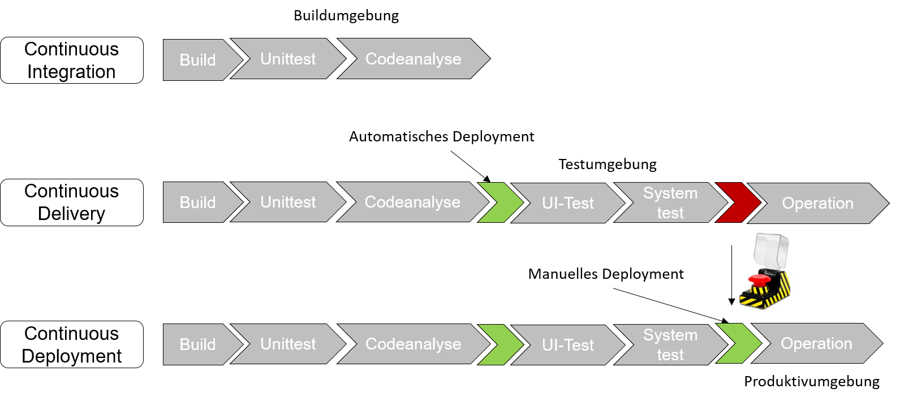
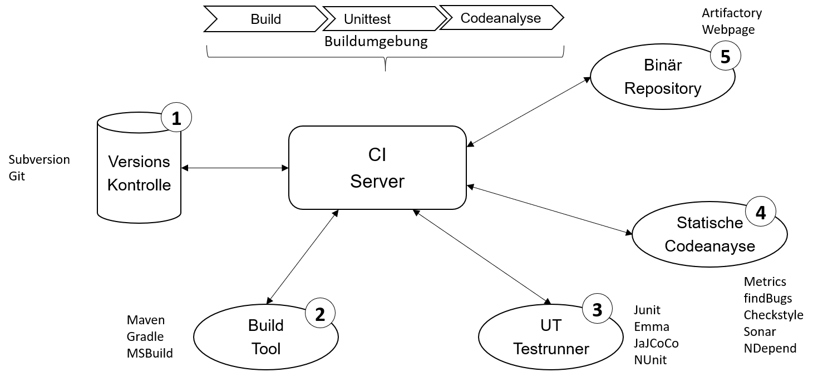
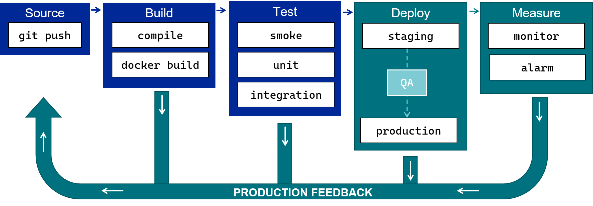
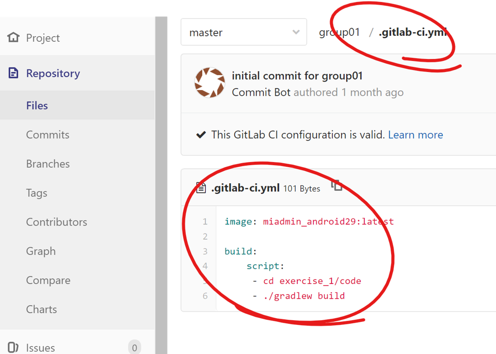

<style>
img[alt~="center"] {
  display: block;
  margin: 0 auto;
}
</style>
# DevOps 
## Build Systeme, CI/CD 
Prof. Dr.-Ing. Andreas Heil

 Licensed under a Creative Commons Attribution 4.0 International license. Icons by The Noun Project.

<!--version-->
v1.0.0
<!--/version-->

---

# Lernziele

Bedeutung und Möglichkeiten des automatischen Buildmanagements **kennen lernen**

---

# Motivation 

* Szenario 1 
  * Ein Team-Mitglied checked am Freitag Abend den letzten BugFix ein. 
  * Das Team-Mitglied is die kommende Woche erkrankt. 
  * Sie möchten bzw. müssen am Montag ein Release erstellen. 
  * Allerdings fehlt eine wichtige Datei des Team-Mitglieds im Repository. 

❓ Wie hätte das verhindert werden können?

---

  # Motivation (Forts.)

* Szenario 2 
  * Ihr Team besteht aus 8 Entwicklern. 
  * »Normalerweise« wird das Release immer auf dem Rechner eines speziellen Team-Mitglieds gebaut. 
  * Das Team-Mitglied ist am fraglichen Tag leider erkrankt. 
  * Sie bauen daher auf dem Rechner eines anderen Team-Mitglieds. 
  * Nach Auslieferung startet die Software beim Kunden nicht.

❓ Was ist passiert und wie hätte das verhindert werden können?

---

# CI/CD 

* Kurzform für **Continuous Integration/Continuous Deployment** 
* Befähigt Entwickler-Teams Software **schneller zu entwickeln**, **zu testen** und **in Betrieb zu nehmen** 
* CI/CD **reduziert die menschlichen Interaktionen** durch einen **möglichst hohen Automatisierungsgrad** 
* **Ausnahme**: Die Finale Inbetriebnahme einer Software in eine produktive Umgebung   

---

# Was wäre ohne Continuous Integration 

Um die Notwendigkeit von **Continuous Integration** zu verstehen hilft es sich vorzustellen was ohne CI wäre:

* **Manuelle Koordination von Entwicklungsaufgaben** im Entwickler-Team
* **Organisationsweite Abstimmungen** wann, wer welche Features und Fehlerkorrekturen umsetzt 
* **Hoher Abstimmungsbedarf** um konkurrierende Tätigkeiten zu vermeiden 
* Als Resultat: **hohe Kosten**, **langsame Entwicklungszyklen**, **hohe Fehlerraten** und ein genervtes Entwickler-Team 
* **Kommunikationsaufwand** und **Kosten** steigen exponentiell mit Größe der Teams

---

# Reduktion von Auslieferungsrisiken 

* Es wird die Abhängigkeit zu einzelnen Personen mit Spezialwissen reduziert 
* Es wird die Gefahr reduziert, dass sich einzelne Personen nicht an Prozesse halten oder diese fehlerhaft durchführen 
* Es wird die Gefahr reduziert, dass eine Fehlkommunikation zwischen den beteiligten stattfindet

---

# CI vs CD

**Continuous Integration**
*  Kontinuierliche Validierung der Code-Basis durch automatisiertes Bauen und Testen 

**Continuous Delivery/Deployment**
* Regelmäßiges Deployment von Artefakten, die die CI erfolgreich durchlaufen haben

---

# Continuous Delivery vs Continuous Deployment

**Ziel**
  * Release- und Deployment-Prozess schneller und zuverlässiger gestalten

**Continuous Delivery**
  * Automatisiertes Vorbereiten eines Releases für die Inbetriebnahme 
  * Jeder mit entsprechenden Berechtigungen kann auf dieser Basis eine Inbetriebnahme durchführen 

  **Continuous Deployment**
  * Automatisierte Inbetriebnahme von (allen) Code-Änderungen ohne explizite Freigabe

---


# Integration - Delivery - Deployment 



---

# Continuous Integration Best Practices

Wie lassen sich die zuvor genannten Probleme angehen?

* Nutzung eines Revisionssystem / Code Repository durch alle Entwickler (z.B: Git)
* Automatisierte Builds (nach jedem Code Check-In/Commit)
* Automatisierte Tests nach jedem Build 
* Regelmäßige Check-Ins/Commits durch Entwickler
* Jeder Check-In/Commit baut 
* Sichtbarkeit über Status des Builds
* Produktionsnahes Testen
* Automatisiertes Deployment auf Testsysteme 
* ...

---

# CI Setup 



---

# Pipeline 

Ausführbare Spezifikation aller Schritte, um eine neue Version einer Software auszuliefern.



---

# Pipeline - Einteilung

Die pipeline besteht aus drei Teilabschnitten 

* **Projekt Pipeline**
  * Installiert Dependencies
  * Führt Linters aus
  * Führt ggf. weitere Skripte aus, die mit dem Source Code in Verbindung stehen 
* **Continuous Integration Pipeline**
  * Baut und Testet den Code
  * Stelle eine auslieferbare (engl. deployable) Version des Codes bereit 
* **Deploy Pipeline**
  * Stellt die zuvor gebaute, ausführbare Version des Codes auf der gewünschten Umgebung bereit

---

# Pipelines - Begriffsklärung

Wie setzen sich Pipelines zusammen?

* **Job**
  * Einzelner Schritt, der in einer Pipeline ausgeführt wird 

* **Stage** 
  * Mehrere Jobs, die aufgrund ihrer Eigenschaften zusammengeführt werden 

* **Pipeline**
  * Mehrere Stages, die nacheinander ausgeführt werden

---

# Pipeline, Stage, Job Beispiel

Folgendes Beispiel: 

```
Build
  npm Dependecies installieren
  ESLint ausführen
  Code-Minifier ausführen
Test
  Unit Tests, Funktionale Tests und Ende-zu-Ende Test ausführen
  pgk ausführen und Code zu einer NodeJS Anwendung kompilieren
Deploy
  Produktion
    EC2 Instanz auf AWS starten
Test
  Auf lokalem Deployment Server starten

```

---

# GitLab Pipeline

* In GitLab `.gitlab-ci.yml` im Root-Ordner des Repositories

```yaml
image: node:10.5.0

stages:
  - build
    - test
      - deploy
      
before_script:
  - npm install

...
```

---

# GitLab Pipeline (Forts.)

```yaml
...
build-min-code:           # Build 
  stage: build            
  script:                  
     - npm install        # npm Dependencies installieren
    - npm run minifier    # und ausführen
            
run-unit-test:            # Test
  stage: test
  script:
    - npm run test       # Tests ausführen
```

---

# GitLab Beispiel 



---

# GitHub Actions 

```yaml
name: Java CI

on: [push]

jobs:
  build:
    runs-on: ubuntu-latest

    steps:
      - uses: actions/checkout@v2
      - name: Set up JDK 1.8
        uses: actions/setup-java@v1
        with:
          java-version: 1.8
      - name: Build with Gradle
        run: ./gradlew build
      - uses: actions/upload-artifact@v2
    	with:
      	  name: Package
          path: build/libs
```

---

# Referenzen 


